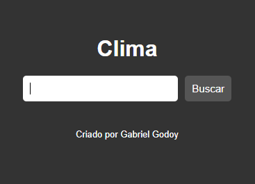
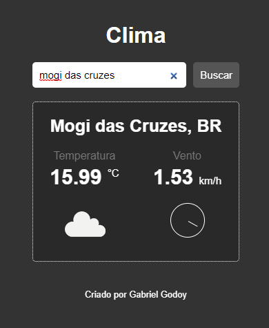

<h1 align="center"> PROJETO CLIMA </h1>

O aplicativo Clima é um projeto com o intuito de praticar as tecnologias de front-end. O aplicativo possui a funcionalidade de buscar as informações climáticas por região  

  <a href="#-tecnologias">Tecnologias</a>&nbsp;&nbsp;&nbsp;|&nbsp;&nbsp;&nbsp;
  <a href="#-projeto">Projeto</a>&nbsp;&nbsp;&nbsp;|&nbsp;&nbsp;&nbsp;
  <a href="#-layout">Links</a>&nbsp;&nbsp;&nbsp;|&nbsp;&nbsp;&nbsp;
  <a href="#-layout">Layout</a>&nbsp;&nbsp;&nbsp;&nbsp;&nbsp;&nbsp;

  

 

  
  

## 🚀 Tecnologias

Esse projeto foi desenvolvido com as seguintes tecnologias:

- HTML
- CSS
- JavaScript
- Conceitos de API

## 💻 Projeto

O projeto consiste na busca por informações climáticas de diferentes localidades do Brasil.  
É possível realizar a pesquisa por nome da cidade ou estado. Essa funcionalidade é concedida por uma API da Open Weather que fornece dados em tempo real que estão relacionadas ao clima.
Para acessa-la, é necessário criar uma conta gratuita na plataforma e seguir as orientações para a construções das rotas. Além disso, se preferir, é possível criar a própria chave de API
para utilizar mais atribuições da plataforma. Por fim, será permitida a manipulação do json e seus atributos confome desejar.

## Links

- Instalação do [VSCode](https://code.visualstudio.com/Docs)
- Documentação do [CSS](https://developer.mozilla.org/pt-BR/docs/Web/CSS)
- Documentação do [HTML](https://developer.mozilla.org/pt-BR/docs/Web/HTML)
- Documentação do [JS](https://developer.mozilla.org/pt-BR/docs/Web/JavaScript)
- Documentação da [API Web](https://developer.mozilla.org/pt-BR/docs/Web/API/Document)
- Documentação [Open Weather](https://home.openweathermap.org/)

## 🔖 Layout

Você pode visualizar o funcionamento da aplicação através [desse link](https://godoybiel97.github.io/projeto-clima-frontend/)
